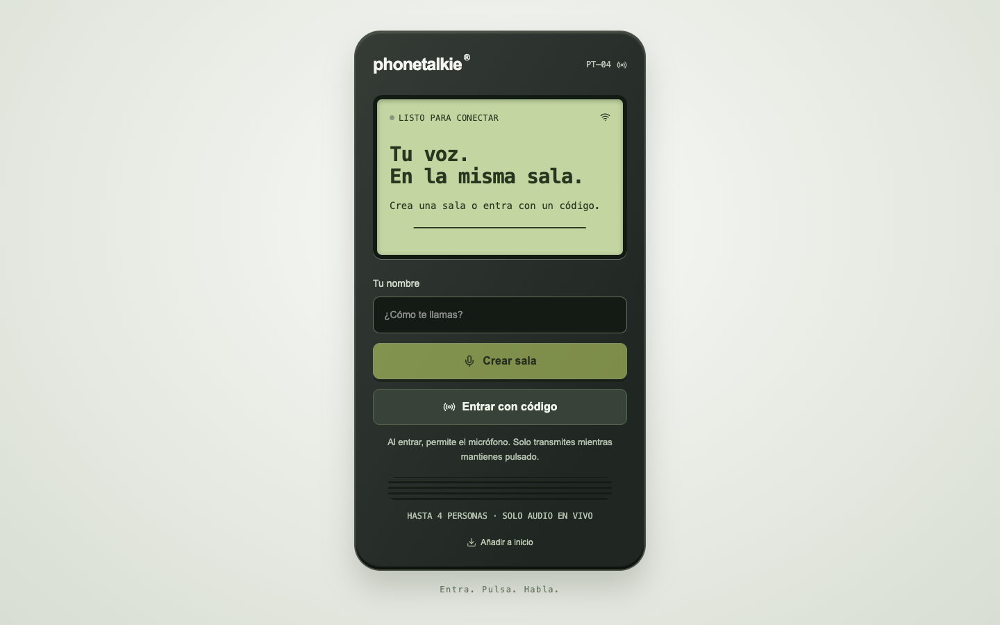
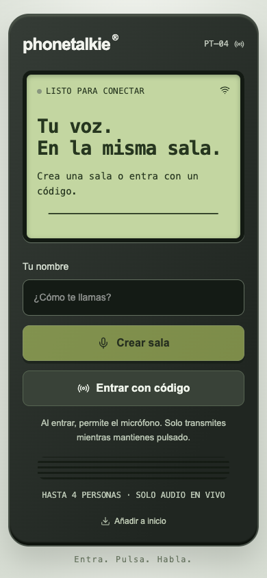

# Phonetalkie

A browser-based walkie-talkie for live conversations across the internet. Create a room, invite your group with a link, four-digit code, or QR code, and hold the talk button to speak. There is no account to create and nothing to install from an app store.

**[Open the live app](https://phonetalkie-edwin.aibuilder00.chatgpt.site)** · The app interface is currently in Spanish.

## What it does

| Feature | Behavior |
| --- | --- |
| Small group rooms | One to four people can join a room. Participants use a display name rather than an account. |
| Push to talk | Only one person transmits at a time. A continuous turn ends when the button is released or after 60 seconds. |
| Easy invitations | Share the room's four-digit code, direct link, or QR code. |
| Live voice | Audio is transmitted in real time with WebRTC; the app does not record calls or provide an audio history. |
| Network fallback | Cloudflare Realtime TURN can relay the connection when the participants' networks prevent a direct WebRTC path. |
| Mobile-friendly experience | The site can be added to a phone's home screen as a progressive web app (PWA). |
| Connection feedback | The interface reports room, microphone, playback, and audio-route status to help diagnose a silent call. |

## How to use it

1. Open the [live app](https://phonetalkie-edwin.aibuilder00.chatgpt.site) in your browser and enter a display name.
2. Select **Crear sala** (Create room), or select **Entrar con código** (Join with code) to enter an existing room. A shared room link or QR code also opens the invitation flow.
3. Allow microphone access when the browser asks. Everyone in a room needs a working microphone to join.
4. Share the room invitation with up to three other people.
5. Hold **Hablar** (Talk) while speaking and release it to listen. If someone else has the floor, wait for their turn to end and press again.

For best results, keep the page open and the phone active during the conversation. Browsers and operating systems may interrupt microphone or playback access when a phone is locked or the page moves to the background. If you can see someone speaking but cannot hear them, check your device volume and the app's audio diagnostics; the browser may also require a tap to resume playback.

## Screenshots

These images show the home screen of the published web app on desktop and mobile.

## Privacy and practical limits

Phonetalkie coordinates rooms and speaking turns, but it does not save conversations or offer a call history. A short room code is convenient for sharing; it should not be treated as private authentication. Audio quality and connectivity still depend on each person's browser, device, microphone, and network. A real long-distance conversation has been completed with the published app, but that does not guarantee every network or device combination will work.

## About this repository

This public repository contains the project presentation and screenshots only. The application source code is kept in a separate private repository. The [live website](https://phonetalkie-edwin.aibuilder00.chatgpt.site) is the place to try Phonetalkie.
